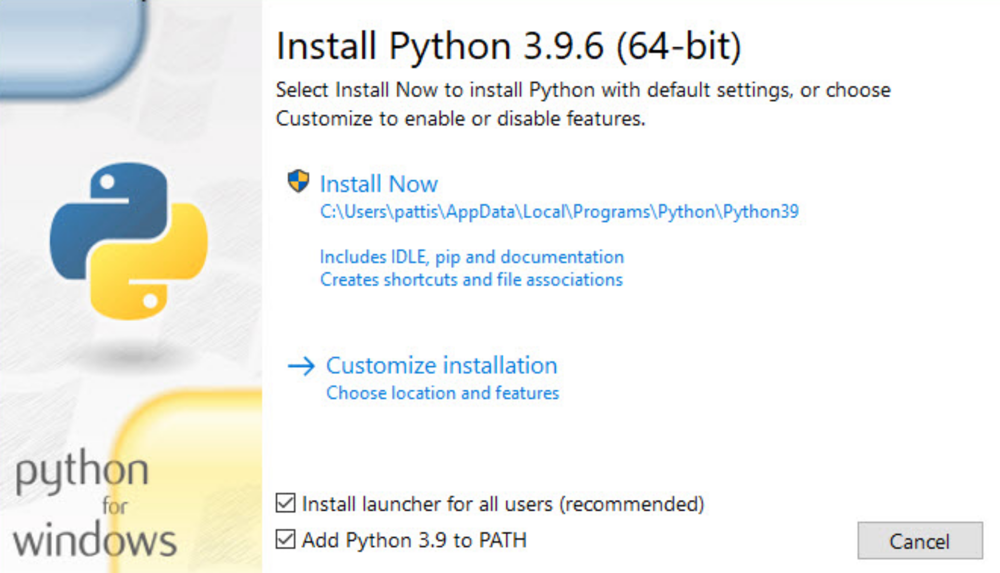
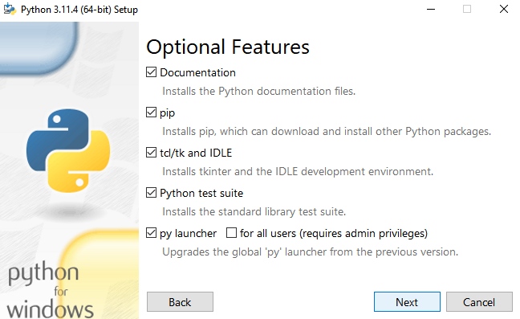
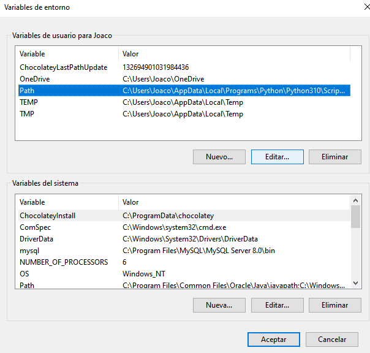

# Instalación del software y organización interna del curso

## Instalación de Python en sus computadoras

Lo único que es fundamental tener instalado para hacer este curso es un Python 3.9 o más nuevo. El curso no depende de un sistema operativo particular o un entorno de desarrollo específico.

Con esto aclarado, casi todo el curso involucra aprender a escribir scripts y correr pequeños programas que leen datos de archivos. Por lo tanto, tendrás que asegurarte de estar cómode trabajando con archivos. Esto involucra principalmente usar un editor de textos para crear programas en Python y poder correrlos desde la terminal.

Las primeras clases vamos a insistir en que usen las herramientas más primitivas, por motivos didácticos. Simplemente un editor de textos y correr el Python desde la línea de comandos. Luego, les sugerimos pasar a un entorno de desarrollo integrado (IDE) más amigable.

Algunes pueden querer hacer este curso usando el entorno de las Jupyter Notebooks o Google Colab. **No lo recomendamos.** A pesar de que estas notebooks son geniales para experimentar, muchos de los ejercicios de este curso están relacionados con la organización de programas. Esto incluye trabajar con funciones, módulos, importar y rehacer código cuyo código fuente puede estar repartido en diferentes archivos. En nuestra experiencia, es difícil reproducir este tipo de entorno de trabajo en una notebook Jupyter.

## Repositorio

El curso está alojado en un repositorio github. Lo vamos modificando a medida que pasa el tiempo. Por eso les recomendamos no clonarlo. En todo caso, preferimos que lo hagas hacia el final del curso, cuando los contenidos estén más estables. Por ese mismo motivo no te recomendamos adelantarte mucho en los contenidos. Por más que subamos clases por adelantado, las estaremos cambiando frecuentemente.

Sí te recomendamos bajarte y descomprimir el archivo [Ejercicios.zip](./Ejercicios.zip). Este archivo contiene una carpeta `/ejercicios_python` y un subdirectorio por clase donde esperamos que hagan los ejercicios del curso, además de otro subdirectorio `/ejercicios_python/Data` con algunos archivos de datos que usaremos en los ejemplos y ejercicios. Lo ideal es que te bajes esto a tu máquina y crees tus programas `.py` en las subcarpetas de `/ejercicios_python` correspondientes a cada clase.

## La instalación

El intérprete de Python puede descargarse de [Python.org](https://www.python.org/). La idea es comenzar usando esta instalación básica las primeras clases.

Si estás en Windows, seguí estos pasos para poder instalarlo correctamente ya que hay que agregar la instalación de Python al PATH. Podés seguir uno de estos 2 caminos (el primero es el más sencillo): agregándolo desde el inicio de la instalación o manualmente una vez instalado.

### Agregándolo desde el inicio de la instalación

1. Si te aparece una casilla que diga “Add Python to PATH […]” en la parte inferior de la ventana de instalación al inicio, asegurate de tickearla, pero en caso contrario tocamos en “Customize Installation”.

   

2. Le damos a “Next”.

   

3. Y tickeamos la tercer opción que dice “Add Python to environment variables”.

   

### Agregándolo manualmente una vez instalado

1. Lo primero que hacemos va a ser ir al explorar de Windows, tocar en “Vista” que está en al barra superior y le damos en “Elementos ocultos” (es un casillero que está ahí a la derecha).

   

2. Lo siguiente va a ser copiar la ruta donde está instalado Python, para eso nos metemos en el disco C (o donde tengan instalado el sistema operativo). Vamos a “usuarios”, nos metemos ahí en la carpeta de nuestrx usuarie. Después vamos a AppData\Local\Programs\Python\Python310\Scripts. Debería quedarles una ruta así: `C:\Users\Joaco\AppData\Local\Programs\Python\Python310\Scripts`. En vez de Python310 les puede decir 311 o alguna otra versión que hayan bajado.
3. Copiamos la ruta y vamos al entorno de variables del sistema. En el buscador ponemos “var” y ya nos aparece. Tocamos ahí.

   

4. Clickeamos donde dice “Variables de entorno…”.

   

5. Ahora clickeamos 1 vez en donde dice “Path” dentro del recuadro de arriba que son las “Variables de usuario para [usuarie]” y le damos a “Editar…”.

   

6. Dentro del Path vamos a agregar nuestra ruta que copiamos antes. Hacemos click en “Nuevo” y pegamos la ruta que teníamos copiada.

   

7. Seguramente la ruta les aparezca abajo de todo. Entonces la clickean una sola vez y luego clickean en el botón que dice “Subir” ahí a la derecha y la suben arriba de todo.
8. Luego, por las dudas, también agreguen otra ruta que es la misma ruta pero sin el “Scripts”, o sea: `C:\Users\Joaco\AppData\Local\Programs\Python\Python310\` y también la suben arriba de todo pero justo debajo de la anterior. Que esta nueva ruta quede anteúltima.

Luego les propondremos usar [VS Code](https://code.visualstudio.com/) como entorno de desarrollo.

Otra posiblidad es descargarse el [Anaconda](https://www.anaconda.com/products/individual) que es un distribución libre y abierta​ de los lenguajes Python y R, utilizada en ciencia de datos, y aprendizaje automático. La ventaja de esta descarga es que ya trae Python, el IDE Spyder y una serie de módulos preinstalados para trabajar con datos y aprendizaje automático.
